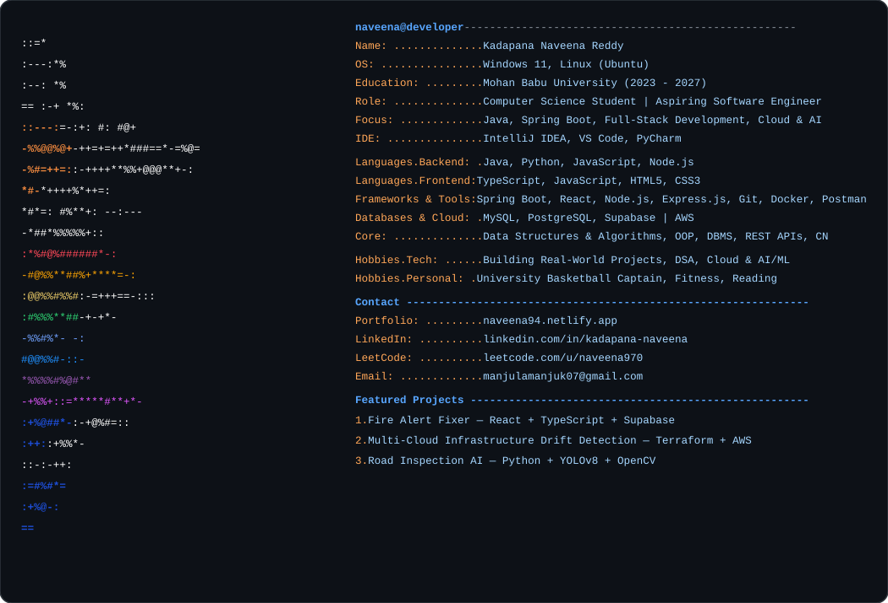

  <h1>Hey 👋, I'm Kadapana Naveena Reddy</h1>
  
<b>Computer Science Student • Full Stack & Backend Developer • Aspiring Software Engineer</b>

  
  

    
    
    
  

  

---

### 👨‍💻 About Me

I am a Computer Science Engineering student and full-stack developer passionate about building scalable backend microservices, real-world cloud architectures, and AI-driven applications.

- 🔭 **Currently Building:** [Fire Alert Fixer](https://github.com/naveena-0) & [Road Inspection AI](https://github.com/naveena-0)
- ☁️ **Cloud & DevOps:** Designing automated infrastructure drift detection with **Terraform + AWS**
- 🧠 **Problem Solving:** Actively practicing **Data Structures & Algorithms in Java**
- 💡 **Interests:** Distributed Systems, Spring Boot Microservices, Cloud Architectures, and Applied AI/ML
- 🤝 **Open to:** Software Engineering Internships, Full-Time SWE Roles, and Open Source Collaborations
- ⚡ *Turning ideas into high-impact, robust software systems.*

---

### 🛠️ Tech Stack & Skills

  <!-- Languages -->
  
<b>Languages</b>

  
  
    

  <!-- Frameworks & Technologies -->
  
<b>Frameworks & Technologies</b>

  

    

  <!-- Databases -->
  
<b>Databases</b>

  

    

  <!-- Tools & Cloud -->
  
<b>Tools & Cloud</b>

  

    

  <!-- Core Computer Science Concepts -->
  
<b>Core Concepts</b>

  

    
    
    
    
    
  

---

### 📊 GitHub Stats & Streak

  <!-- Stats Summary Card -->
  
  &nbsp;
  <!-- Live Streak Card with Ring Gauge -->
  

 

---

### 📌 GitHub Overview & Activity

  <!-- GitHub Overview Card -->
  
  &nbsp;
  <!-- Productive Time Activity Card -->
  

 

  <!-- Top Languages by Repo (Donut Chart) -->
  
  &nbsp;
  <!-- Top Languages by Commit (Donut Chart) -->
  

---

### 🚀 Featured Projects

- 🚨 **Fire Alert Fixer** — Automated fire alert & response platform built with React, TypeScript, and Supabase.
- ☁️ **Automated Multi-Cloud Drift Detection** — Cloud infrastructure governance & drift detection using Terraform, Python, and AWS.
- 🛣️ **Road Inspection AI** — Computer vision road quality & defect detection pipeline using Python, YOLOv8, and OpenCV.

---

### 🌐 Connect With Me

  
  &nbsp;
  
  &nbsp;
  

    
  
<i>Let's build something interesting.</i>

